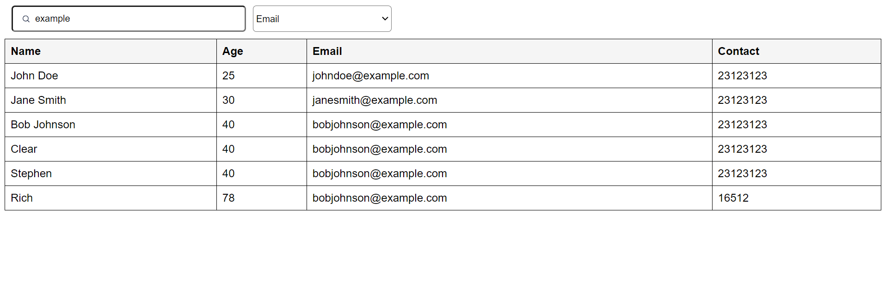
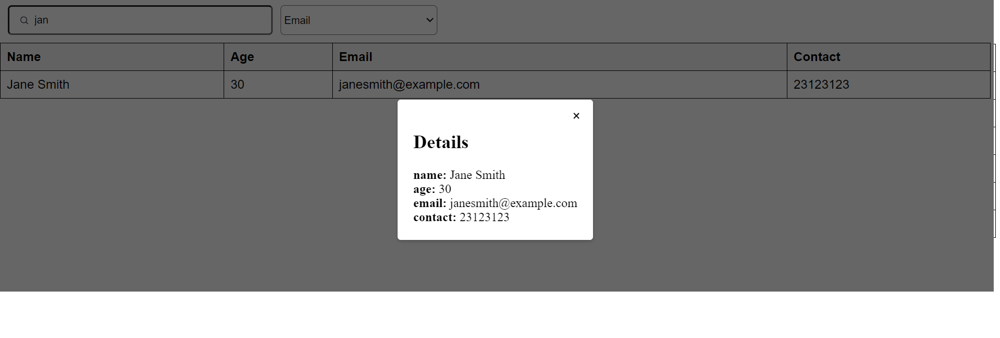

# sf-react-table


# Table features
# Soon ,Search and Filter

This project is a React application that includes a table component with search and filter functionality.

## Table of Contents

- [Installation](#installation)
- [Usage](#usage)
- [Features](#features)
- [Contributing](#contributing)
- [License](#license)

## Installation

1. Clone the repository: `git clone https://github.com/stephenPolFajardo/sf-react-table.git`
2. Navigate to the project directory: `cd your-repo`
3. Install the dependencies: `npm install`

## Usage

To start the development server and run the application, use the following command:
# Example Screenshots

This is the Table



Modal




```bash
npm start


